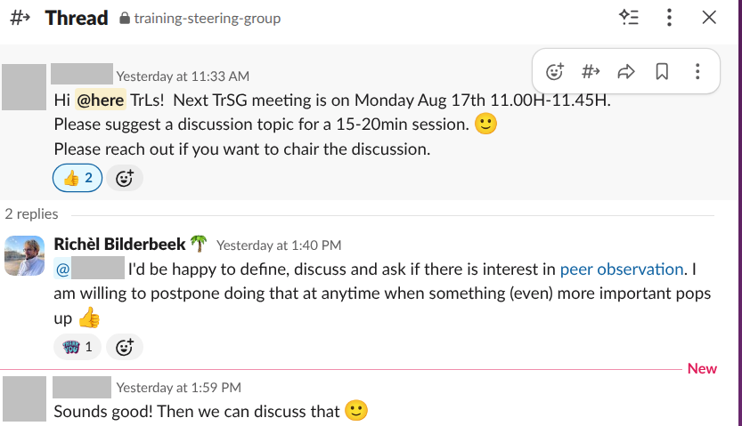

# training_steering_group_discussion_20260817_peer_observation

  
What is the goal of this discussion?

  To discuss peer observation:

  - What is it?
  - Why is it important?
  - Find people that are interested

  
What caused this talk?

  

  > A Slack post, posted at 2026-06-18

  
Who already has experienced a formal peer observation?

  <!-- Goal: find out pre-existing knowledge -->

  These persons will be asked less questions :-)

  
For those who have never experienced a formal peer observation: have you heard of peer observation? If yes, what did you understand that it is?

  Definition here

- Q: There are many things as teachers that we can put effort into.
  Do you think/feel that peer observation is a useful exercise?

Give answer.

- Q: 

