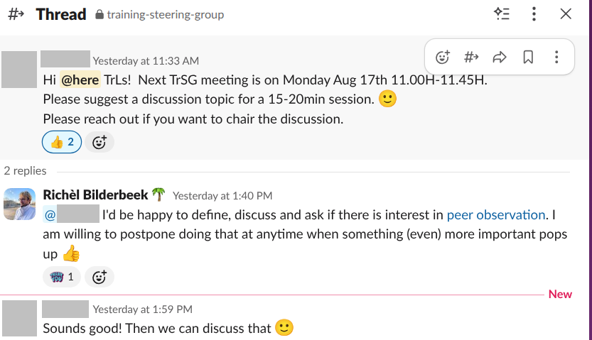
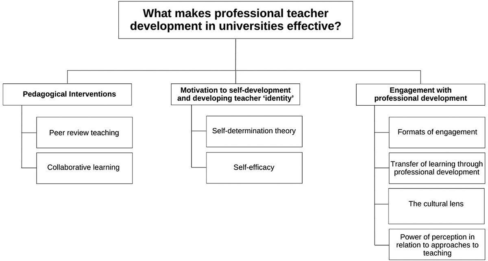

# training_steering_group_discussion_20260817_peer_observation

  
What is the goal of this discussion?

  To discuss peer observation:

  - What is it?
  - Why is it important?
  - Find people that are interested

  
What caused this talk?

  

  > A Slack post, posted at 2026-06-18

  
Who already has experienced a formal peer observation?

  <!-- Goal: find out pre-existing knowledge -->

  These persons will be asked less questions :-)

  
For those who have never experienced a formal peer observation: have you heard of peer observation? If yes, what did you understand that it is?

  From `[Gosling, 2002]`:

  **Characteristic**                   | **Peer Review Model** 
  -------------------------------------|---------------------------------------------------------------
  Who does it & to whom?               | Teachers observe each other
  Purpose                              | Analysis, discussion, wider experience of teaching methods
  Outcome                              | Non-judgemental, constructive feedback
  Relationship of observer to observed | Equality/mutuality
  Confidentiality                      | Between observer and the observed
  Judgement                            | Non-judgemental, constructive feedback
  What is observed?                    | Teaching performance, class, learning materials
  Who benefits?                        | Mutual between peers
  Conditions for success               | Teaching is valued, discussed
  Risks                                | Complacency, conservatism, unfocused

  
There are many things as teachers that we can put effort into. To what extent do you think/feel/guess that peer observation is a useful exercise?

  Getting feedback from colleagues
  is one of the two most important way to grow as a
  teacher `[Lowyck and Verloop, 1995]`:

  > In the literature on the learning or professional development of teachers,
  > reference is frequently made, in addition to **peer learning**,
  > to several other
  > approaches or interventions that are said to be particularly 
  > conducive to this.
  >
  > (translation of `[Lowyck and Verloop, 1995]` section 5.4.6)

  And there are plenty of other references too:

  > Feedback is identified as a tool of choice to support the educational
  > development of university teachers `[Bélisle and Fernandez, 2024]`

  And the main finding of `[Smith and Wyness, 2025]`:

  > [...] pedagogical collaboration, in the form of
  > peer review teaching and the development of communities,
  > is valued amongst university teachers 

  **On its own, workshops are not enough**:

  > [O]n their own, structured approaches [e.g. workshops]
  > may be insufficient. Whereas structured interventions [have advantages],
  > other methods that take advantage of experiential learning in the workplace,
  > which include guided reflection, peer coaching and mentorship, should be con-
  > sidered. `[Steinert et al., 2016]`

  **On its own, feedback from learners is not useful**:

  > There is, therefore, no evidence that the use of the questionnaire was
  > making any contribution to improving the overall quality of teaching
  > and learning of the departments, at least as perceived by the
  > students `[Kember et al., 2002]`

  
What is the procedure of a peer observation?

  Based on `[Siddiqui et al., 2007]`:

  Event                             |Goal
  ----------------------------------|---------------------------------------------
  Meeting before observing a session|Clarify expectations
  The observation takes place       |Have different perspectives on the same event
  You meet after observing a session|Discuss ideas

  
What is recommended for a peer observation?

  Tip|Title, from `[Siddiqui et al., 2007]`
  ---|---------------------------------------------------------
  1  |**Choose the observer carefully**
  2  |Set aside time for the peer observation
  3  |Clarify expectations
  4  |Familiarise yourself with the course
  5  |Select the instrument wisely
  6  |Include students
  7  |Be objective
  8  |**Resist the urge to compare with your own teaching style**
  9  |Do not intervene
  10 |Follow the general principles for feedback
  11 |Respect confidentiality
  12 |Make it a learning experience

  
How can I do peer observation?

  Send me a private message.

## Other questions

  
Besides peer observations, what is the other most important way to grow as a teacher?

  The other is
  [writing reflections](https://richelbilderbeek.github.io/teaching/teaching_overview/)
  `[Lowyck and Verloop, 1995]`:

  > The term most frequently used in connection with the focus on
  > professional growth is undoubtedly '**reflection**'. 
  >
  > (translation of `[Lowyck and Verloop, 1995]` section 5.4.6)

  
What are other evidence-based ways to grow as a teacher?

  The best ways to improve higher education teaching are,
  from the meta-analysis `[Steinert et al., 2016]`:

  - ongoing pedagogical development, e.g. reflections and peer observations
  - using student-centered, active, and feedback-rich teaching
  - structured feedback, e.g. peer observations

## References

<!-- markdownlint-disable MD013 --><!-- References are not split up over lines to help copy-pasting, hence will break 80 characters per line -->

- `[Bélisle and Fernandez, 2024]` Bélisle, Marilou, Valérie Jean, and Nicolas Fernandez. "The educational development of university teachers: mapping the landscape." Frontiers in Education. Vol. 9. Frontiers Media SA, 2024.
- `[Fernandes et al., 2023]` Fernandes, Sandra, et al. "Teacher professional development in higher education: The impact of pedagogical training perceived by teachers." Education Sciences 13.3 (2023): 309. [Site](https://www.mdpi.com/2195836)

  
What is the full quote that is relevant?

  In '3.2.2. Suggestions for Improvement in Future Programs':

  > The impact of the pedagogical training on teachers’ practices and conceptions should
  > be supported by initiatives that strengthen the teachers’ confidence, stimulate the
  > development of research on teaching practice, and build a community of practice that
  > provides opportunities for individual coaching/mentoring.

- `[Gosling, 2002]` Gosling, David. "Models of peer observation of teaching." Generic Centre: Learning and Teaching Support Network 8.10 (2002): 08.
- `[Kember et al., 2002]` Kember, David, Doris YP Leung, and KyP Kwan. "Does the use of student feedback questionnaires improve the overall quality of teaching?." Assessment & Evaluation in Higher Education 27.5 (2002): 411-425.

- `[Kiziltepe and Sali, 2021]` Kiziltepe, Zeynep, and Özlem Sali. "Professional development for effective teaching in higher education." International Journal of Higher Education Pedagogies 2.4 (2021): 28-37.

  
What is the full quote that is referenced?

  > Results showed that the 97% of the respondents had never
  > had a professional development program before.

  This is about a private university in Turkey.

- `[Lowyck and Verloop, 1995]` Lowyck, Joost, and Nico Verloop. Onderwijskunde: een kennisbasis voor professionals. Wolters-Noordhoff, 1995.

  
What is the full quote that is referenced?

  > ### 5.4.6 Some specific ways to promote learning
  > 
  > In the literature on the learning or professional development of teachers,
  > reference is frequently made, in addition to **peer learning**,
  > to several other
  > approaches or interventions that are said to be particularly 
  > conducive to this.
  > The matters discussed in this section relate in principle
  > to both the learning of prospective teachers and the learning of
  > current teachers.
  > The term most frequently used in connection with the focus on
  > professional growth is undoubtedly '**reflection**'. 
  > Although
  > in a general sense
  > become simply ‘thinking about’ one’s own functioning,
  > the meaning attributed to this term proves to be
  > by no means unambiguous. For example, for some, the essence of reflection is
  > calling into question the role of the school in contemporary society,
  > in which naturally questions are asked about one’s own role therein and the effects of
  > one’s own actions.
  >
  > (translation of `[Lowyck and Verloop, 1995]` section 5.4.6)

- `[Siddiqui et al., 2007]` Siddiqui, Zarrin Seema, Diana Jonas-Dwyer, and Sandra E. Carr. "Twelve tips for peer observation of teaching." Medical teacher 29.4 (2007): 297-300.

- `[Smith and Wyness, 2025]` Smith, Bethany, and Lynne Wyness. "What makes professional teacher development in universities effective? Lessons from an international systematised review." Professional Development in Education 51.7 (2025): 1550-1572. [DOI](https://doi.org/10.1080/19415257.2024.2386666)

> `[Smith and Wyness, 2025]`, figure 1

- `[Steinert et al., 2016]` Steinert, Yvonne, et al.
  "A systematic review of faculty development initiatives designed to enhance
  teaching effectiveness: A 10-year update:
  BEME Guide No. 40." Medical teacher 38.8 (2016): 769-786.

  
What is the full quote that is referenced?

  Under 'Implications for practice',
  section 'Moving from workshops to the workplace':

  > Moving from workshops to the workplace
  > The current literature demonstrates a continuing over-
  > reliance on formal, structured approaches such as work-
  > shops, short courses and seminars. Such approaches are
  > expected and reflect the growth of the field to incorpor-
  > ate more systematic planning and program design.
  > However, on their own, structured approaches may be
  > insufficient. Whereas structured interventions appear to
  > have the stated advantage of ease of scheduling, build-
  > ing a community of interested educators, and increasing
  > motivation, other methods that take advantage of experi-
  > ential learning in the workplace, which include guided
  > reflection, peer coaching and mentorship, should be con-
  > sidered.

  This paper used 111 studies.

<!-- markdownlint-enable MD013 -->

