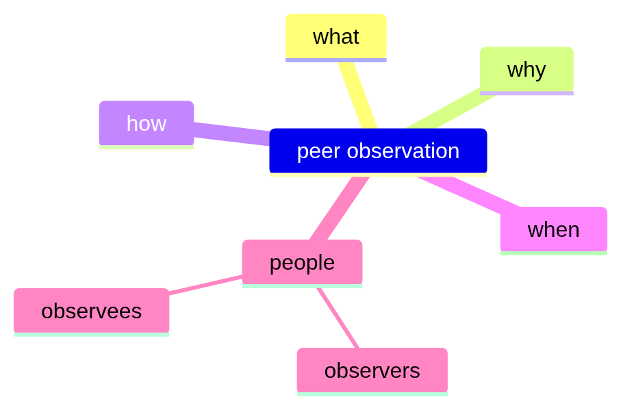
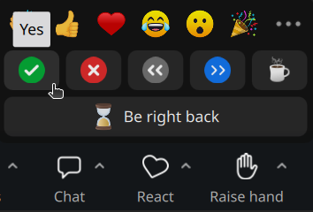
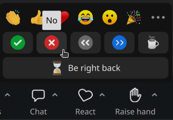
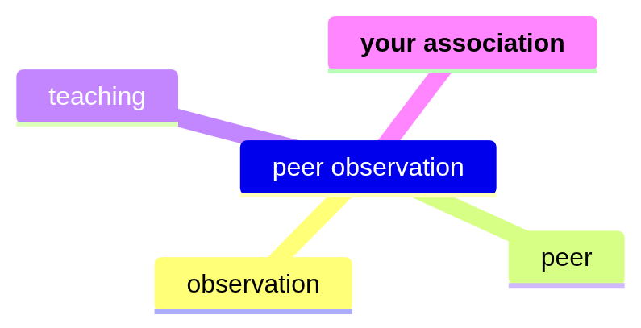
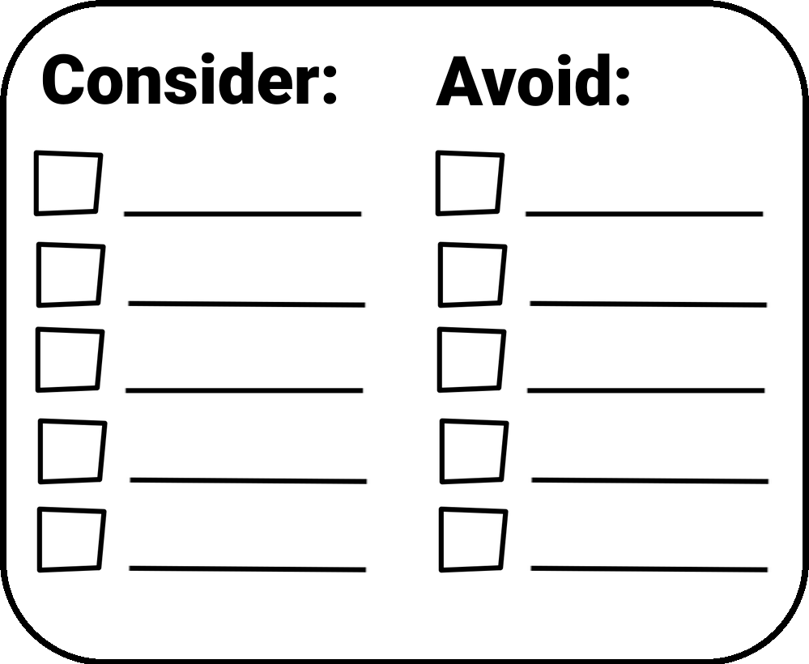

# Peer observation

[https://github.com/richelbilderbeek/](https://github.com/richelbilderbeek/training_steering_group_discussion_20260817_peer_observation) [training_steering_group_discussion_20260817_peer_observation](https://github.com/richelbilderbeek/training_steering_group_discussion_20260817_peer_observation)

 Richèl 'Rea-shell' Bilderbeek 

## The goal of this discussion

## Who already has experienced a formal peer observation?

Please share using Zoom:

| Yes, I have                       | No, I have not                      |
|-----------------------------------|-------------------------------------|
|  |  |

## What is peer observation?

## What peer observation is 1/3

My favorite description, from `[Gosling, 2002]`:

| **Characteristic**       | **Peer Review Model**                                      |
|--------------------------|------------------------------------------------------------|
| Who does it and to whom? | Teachers observe each other                                |
| Purpose                  | Analysis, discussion, wider experience of teaching methods |
| Outcome                  | Non-judgemental, constructive feedback                     |

## What peer observation is 2/3

| **Characteristic**                   | **Peer Review Model**                           |
|--------------------------------------|-------------------------------------------------|
| Relationship of observer to observed | **Equality/mutuality**                          |
| Confidentiality                      | Between observer and the observed               |
| Judgement                            | Non-judgemental, constructive feedback          |
| What is observed?                    | Teaching performance, class, learning materials |

## What peer observation is 3/3

| **Characteristic**     | **Peer Review Model**                |
|------------------------|--------------------------------------|
| Who benefits?          | **Mutual between peers**             |
| Conditions for success | Teaching is valued, discussed        |
| Risks                  | Complacency, conservatism, unfocused |

## How useful is peer observation?

## The usefulness of peer observation

Getting feedback from colleagues is 

- **one of the two most important ways** to grow as a teacher `[Lowyck and Verloop, 1995]`
- **thé** tool of choice to support the educational development of university teachers `[Bélisle and Fernandez, 2024]`
- in professional teacher development in universities,
  it is **one of the few things** valued among
  university teachers `[Smith and Wyness, 2025]`

## What are recommendations for a peer observation?

## Recommendations for a peer observation 1/2

| Tip | Title, from `[Siddiqui et al., 2007]`                             |
|-----|-------------------------------------------------------------------|
| 1   | **Choose the observer carefully**                                 |
| 2   | Set aside time for the peer observation \[assume three meetings\] |
| 3   | Clarify expectations                                              |
| 4   | Familiarise yourself with the course                              |
| 5   | **Select the instrument wisely**                                  |
| 6   | Include students                                                  |

## Recommendations for a peer observation 2/2

| Tip | Title, from `[Siddiqui et al., 2007]`                       |
|-----|-------------------------------------------------------------|
| 7   | Be objective                                                |
| 8   | **Resist the urge to compare with your own teaching style** |
| 9   | Do not intervene                                            |
| 10  | Follow the general principles for feedback                  |
| 11  | Respect confidentiality                                     |
| 12  | Make it a learning experience                               |

## How can I do peer observation?

Choose an observer carefully.

I do volunteer to be in either role. You can find my teaching portfolio at <https://richelbilderbeek.github.io/teaching>

## Questions?

Any questions?

## References 1/7

-   `[Bélisle and Fernandez, 2024]` Bélisle, Marilou, Valérie Jean, and Nicolas Fernandez. "The educational development of university teachers: mapping the landscape." Frontiers in Education. Vol. 9. Frontiers Media SA, 2024.

> Feedback is identified as a tool of choice to support the educational development of university teachers `[Bélisle and Fernandez, 2024]`

(I feel the wording should be 'Feedback is identified as **the** tool')

## References 2/7

-   `[Fernandes et al., 2023]` Fernandes, Sandra, et al. "Teacher professional development in higher education: The impact of pedagogical training perceived by teachers." Education Sciences 13.3 (2023): 309. [Site](https://www.mdpi.com/2195836)
-   `[Gosling, 2002]` Gosling, David. "Models of peer observation of teaching." Generic Centre: Learning and Teaching Support Network 8.10 (2002): 08.

## References 3/7

-   `[Kember et al., 2002]` Kember, David, Doris YP Leung, and KyP Kwan. "Does the use of student feedback questionnaires improve the overall quality of teaching?." Assessment & Evaluation in Higher Education 27.5 (2002): 411-425.
-   `[Kiziltepe and Sali, 2021]` Kiziltepe, Zeynep, and Özlem Sali. "Professional development for effective teaching in higher education." International Journal of Higher Education Pedagogies 2.4 (2021): 28-37.

## References 4/7

-   `[Lowyck and Verloop, 1995]` Lowyck, Joost, and Nico Verloop. Onderwijskunde: een kennisbasis voor professionals. Wolters-Noordhoff, 1995.

> In the literature on the learning or professional development of teachers, reference is frequently made, in addition to **peer learning**, to several other approaches or interventions that are said to be particularly conducive to this.
>
> (translation of `[Lowyck and Verloop, 1995]` section 5.4.6)

## References 5/7

-   `[Siddiqui et al., 2007]` Siddiqui, Zarrin Seema, Diana Jonas-Dwyer, and Sandra E. Carr. "Twelve tips for peer observation of teaching." Medical teacher 29.4 (2007): 297-300.

## References 6/7

-   `[Smith and Wyness, 2025]` Smith, Bethany, and Lynne Wyness. "What makes professional teacher development in universities effective? Lessons from an international systematised review." Professional Development in Education 51.7 (2025): 1550-1572. [DOI](https://doi.org/10.1080/19415257.2024.2386666)

> \[...\] pedagogical collaboration, in the form of peer review teaching and the development of communities, is valued amongst university teachers

(I feel the wording should be '\[...\] is **one of the few things that** is valued \[...\]')

## References 7/7

-   `[Steinert et al., 2016]` Steinert, Yvonne, et al. "A systematic review of faculty development initiatives designed to enhance teaching effectiveness: A 10-year update: BEME Guide No. 40." Medical teacher 38.8 (2016): 769-786.

# Appendix

## What caused this talk

## Comparing the usefulness of peer observation 1/2

**On its own, workshops are not enough**:

> \[O\]n their own, structured approaches \[e.g. workshops\] may be insufficient. Whereas structured interventions \[have advantages\], other methods that take advantage of experiential learning in the workplace, which include guided reflection, peer coaching and mentorship, should be con- sidered. `[Steinert et al., 2016]`

## Comparing the usefulness of peer observation 2/2

**On its own, feedback from learners is not useful**:

> There is, therefore, no evidence that the use of the questionnaire was making any contribution to improving the overall quality of teaching and learning of the departments, at least as perceived by the students `[Kember et al., 2002]`

## Besides peer observations, what is the other most important way to grow as a teacher?

The other is [writing reflections](https://richelbilderbeek.github.io/teaching/teaching_overview/) `[Lowyck and Verloop, 1995]`:

> The term most frequently used in connection with the focus on professional growth is undoubtedly '**reflection**'.
>
> (translation of `[Lowyck and Verloop, 1995]` section 5.4.6)

## What are other evidence-based ways to grow as a teacher?

The best ways to improve higher education teaching are, from the meta-analysis `[Steinert et al., 2016]`:

-   ongoing pedagogical development, e.g. reflections and peer observations
-   using student-centered, active, and feedback-rich teaching
-   structured feedback, e.g. peer observations

